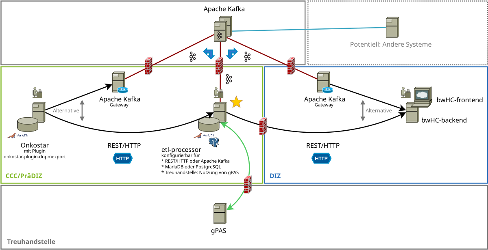

# ETL-Processor for bwHC data [](https://github.com/CCC-MF/etl-processor/actions/workflows/test.yml)

Diese Anwendung versendet ein bwHC-MTB-File an das bwHC-Backend und pseudonymisiert die Patienten-ID.

### Einordnung innerhalb einer DNPM-ETL-Strecke

Diese Anwendung erlaubt das Entgegennehmen HTTP/REST-Anfragen aus dem Onkostar-Plugin **[onkostar-plugin-dnpmexport](https://github.com/CCC-MF/onkostar-plugin-dnpmexport)**.

Der Inhalt einer Anfrage, wenn ein bwHC-MTBFile, wird pseudonymisiert und auf Duplikate geprüft.
Duplikate werden verworfen, Änderungen werden weitergeleitet.

Löschanfragen werden immer als Löschanfrage an das bwHC-backend weitergeleitet.



#### HTTP/REST-Konfiguration

Anfragen werden, wenn nicht als Duplikat behandelt, nach der Pseudonymisierung direkt an das bwHC-Backend gesendet.

#### Konfiguration für Apache Kafka

Anfragen werden, wenn nicht als Duplikat behandelt, nach der Pseudonymisierung an Apache Kafka übergeben.
Eine Antwort wird dabei ebenfalls mithilfe von Apache Kafka übermittelt und nach der Entgegennahme verarbeitet.

Siehe hierzu auch: https://github.com/CCC-MF/kafka-to-bwhc

## Pseudonymisierung der Patienten-ID

Wenn eine URI zu einer gPAS-Instanz (Version >= 2023.1.0) angegeben ist, wird diese verwendet.
Ist diese nicht gesetzt. wird intern eine Anonymisierung der Patienten-ID vorgenommen.

* `APP_PSEUDONYMIZE_PREFIX`: Standortbezogenes Prefix - `UNKNOWN`, wenn nicht gesetzt
* `APP_PSEUDONYMIZE_GENERATOR`: `BUILDIN` oder `GPAS` - `BUILDIN`, wenn nicht gesetzt

### Eingebaute Pseudonymisierung

Wurde keine oder die Verwendung der eingebauten Pseudonymisierung konfiguriert, so wird für die Patienten-ID der
entsprechende SHA-256-Hash gebildet und Base64-codiert - hier ohne endende "=" - zuzüglich des konfigurierten Prefixes
als Patienten-Pseudonym verwendet.

### Pseudonymisierung mit gPAS

Wurde die Verwendung von gPAS konfiguriert, so sind weitere Angaben zu konfigurieren.

* `APP_PSEUDONYMIZE_GPAS_URI`: URI der gPAS-Instanz inklusive Endpoint (
  z.B. `http://localhost:8080/ttp-fhir/fhir/gpas/$$pseudonymizeAllowCreate`) 
* `APP_PSEUDONYMIZE_GPAS_TARGET`: gPas Domänenname
* `APP_PSEUDONYMIZE_GPAS_USERNAME`: gPas Basic-Auth Benutzername
* `APP_PSEUDONYMIZE_GPAS_PASSWORD`: gPas Basic-Auth Passwort
* `APP_PSEUDONYMIZE_GPAS_SSLCALOCATION`: Root Zertifikat für gPas, falls es dediziert hinzugefügt werden muss.

## Transformation von Werten

In Onkostar kann es vorkommen, dass ein Wert eines Merkmalskatalogs an einem Standort angepasst wurde und dadurch nicht dem Wert entspricht,
der vom bwHC-Backend akzeptiert wird.

Diese Anwendung bietet daher die Möglichkeit, eine Transformation vorzunehmen. Hierzu muss der "Pfad" innerhalb des JSON-MTB-Files angegeben werden und
welcher Wert wie ersetzt werden soll.

Hier ein Beispiel für die erste (Index 0 - weitere dann mit 1,2,...) Transformationsregel:

* `APP_TRANSFORMATIONS_[0]_PATH`: Pfad zum Wert in der JSON-MTB-Datei. Beispiel: `diagnoses[*].icd10.version` für **alle** Diagnosen
* `APP_TRANSFORMATIONS_[0]_FROM`: Angabe des Werts, der ersetzt werden soll. Andere Werte bleiben dabei unverändert.
* `APP_TRANSFORMATIONS_[0]_TO`: Angabe des neuen Werts.

## Mögliche Endpunkte

Für REST-Requests als auch zur Nutzung von Kafka-Topics können Endpunkte konfiguriert werden.

Es ist dabei nur die Konfiguration eines Endpunkts zulässig.
Werden sowohl REST als auch Kafka-Endpunkt konfiguriert, wird nur der REST-Endpunkt verwendet.

### REST

Folgende Umgebungsvariablen müssen gesetzt sein, damit ein bwHC-MTB-File an das bwHC-Backend gesendet wird:

* `APP_REST_URI`: URI der zu benutzenden API der bwHC-Backend-Instanz. z.B.: `http://localhost:9000/bwhc/etl/api`

### Kafka-Topics

Folgende Umgebungsvariablen müssen gesetzt sein, damit ein bwHC-MTB-File an ein Kafka-Topic übermittelt wird:

* `APP_KAFKA_TOPIC`: Zu verwendendes Topic zum Versenden von Anfragen
* `APP_KAFKA_RESPONSE_TOPIC`: Topic mit Antworten über den Erfolg des Versendens. Standardwert: `APP_KAFKA_TOPIC` mit Anhang "_response".
* `APP_KAFKA_GROUP_ID`: Kafka GroupID des Consumers. Standardwert: `APP_KAFKA_TOPIC` mit Anhang "_group".
* `APP_KAFKA_SERVERS`: Zu verwendende Kafka-Bootstrap-Server als kommagetrennte Liste

Wird keine Rückantwort über Apache Kafka empfangen und es gibt keine weitere Möglichkeit den Status festzustellen, verbleibt der Status auf `UNKNOWN`.

Weitere Einstellungen können über die Parameter von Spring Kafka konfiguriert werden.

Lässt sich keine Verbindung zu dem bwHC-Backend aufbauen, wird eine Rückantwort mit Status-Code `900` erwartet, welchen es
für HTTP nicht gibt.

#### Retention Time

Generell werden in Apache Kafka alle Records entsprechend der Konfiguration vorgehalten.
So wird ohne spezielle Konfiguration ein Record für 7 Tage in Apache Kafka gespeichert.
Es sind innerhalb dieses Zeitraums auch alte Informationen weiterhin enthalten, wenn der Consent später abgelehnt wurde.

Durch eine entsprechende Konfiguration des Topics kann dies verhindert werden.

Beispiel - auszuführen innerhalb des Kafka-Containers: Löschen alter Records nach einem Tag
```
kafka-configs.sh --bootstrap-server localhost:9092 --alter --topic test --add-config retention.ms=86400000
```

#### Key based Retention

Möchten Sie hingegen immer nur die letzte Meldung für einen Patienten und eine Erkrankung in Apache Kafka vorhalten,
so ist die nachfolgend genannte Konfiguration der Kafka-Topics hilfreich.


* `retention.ms`: Möglichst kurze Zeit in der alte Records noch erhalten bleiben, z.B. 10 Sekunden 10000
* `cleanup.policy`: Löschen alter Records und Beibehalten des letzten Records zu einem Key [delete,compact]

Beispiele für ein Topic `test`, hier bitte an die verwendeten Topics anpassen.

```
kafka-configs.sh --bootstrap-server localhost:9092 --alter --topic test --add-config retention.ms=10000
kafka-configs.sh --bootstrap-server localhost:9092 --alter --topic test --add-config cleanup.policy=[delete,compact]
```

Da als Key eines Records die (pseudonymisierte) Patienten-ID und die (anonymisierte) Erkrankungs-ID verwendet wird,
stehen mit obiger Konfiguration der Kafka-Topics nach 10 Sekunden nur noch der jeweils letzte Eintrag für den entsprechenden
Key zur Verfügung.

Da der Key sowohl für die Records in Richtung bwHC-Backend für die Rückantwort identisch aufgebaut ist, lassen sich so
auch im Falle eines Consent-Widerspruchs die enthaltenen Daten als auch die Offenlegung durch Verifikationsdaten in der
Antwort effektiv verhindern, da diese nach 10 Sekunden gelöscht werden.
Es steht dann nur noch die jeweils letzten Information zur Verfügung, dass für einen Patienten/eine Erkrankung
ein Consent-Widerspruch erfolgte.

## Docker-Images

Diese Anwendung ist auch als Docker-Image verfügbar: https://github.com/CCC-MF/etl-processor/pkgs/container/etl-processor

### Images lokal bauen 

```bash
./gradlew bootBuildImage
```

## Deployment
*Ausführen als Docker Conatiner:*

```bash
cd ./deploy
cp env-sample.env .env
```
Wenn gewünscht, Änderungen in der `.env` vornehmen.

```bash
docker compose up -d
```

## Entwicklungssetup

Zum Starten einer lokalen Entwicklungs- und Testumgebung kann die beiliegende Datei `dev-compose.yml` verwendet werden.
Diese kann zur Nutzung der Datenbanken **MariaDB** als auch **PostgreSQL** angepasst werden.

Zur Nutzung von Apache Kafka muss dazu ein Eintrag im hosts-File vorgenommen werden und der Hostname `kafka` auf die lokale
IP-Adresse verweisen. Ohne diese Einstellung ist eine Nutzung von Apache Kafka außerhalb der Docker-Umgebung nicht möglich.

Beim Start der Anwendung mit dem Profil `dev` wird die in `dev-compose.yml` definierte Umgebung beim Start der
Anwendung mit gestartet:

```
SPRING_PROFILES_ACTIVE=dev ./gradlew bootRun
```

Die Datei `application-dev.yml` enthält hierzu die Konfiguration für das Profil `dev`.

Beim Ausführen der Integrationstests wird eine Testdatenbank in einem Docker-Container gestartet.
Siehe hier auch die Klasse `AbstractTestcontainerTest` unter `src/integrationTest`.
